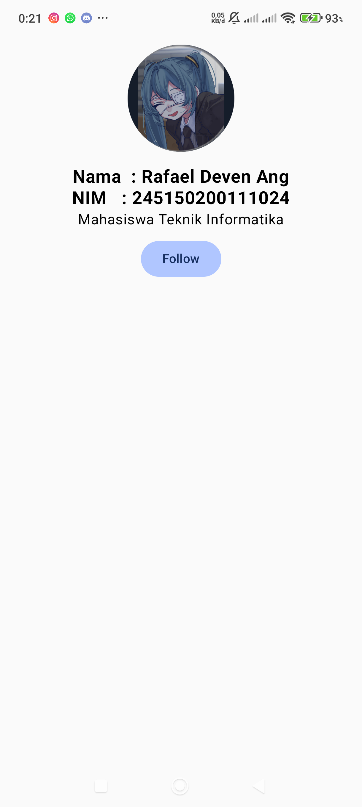
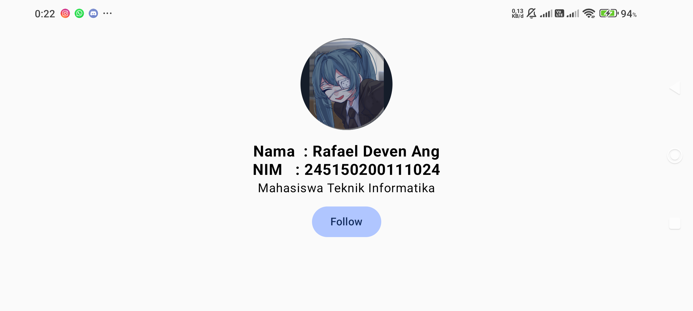

penjelasan kode

aplikasi berfungsi untuk menampilkan foto profil , beserta nama nim dan tombol follow.

elemen elemen disusun menggunakan column, yang di modify dengan padding,
dan fillmaxwidth (agar kolom memanjang seluruh width layar)

di dalam kolom masukan image dengan source profil. modify dengan clip lingkaran, dengan background gelap

lalu pakai spacer untuk memisahkan

lalu masukan text nama , nimm, dan deskripsi "Mahasiswa Teknik Informatika"

terakhir pasang button yang menyimpan boolean isFollowed  dengan remember mutableStateOf

semua elemen tadi lakukan alignment center secara horizontal

      
Analisis singkat keuntungan Compose dibandingkan XML layout:

Compose memudahkan pengembangan UI karena bersifat deklaratif dibanding XML layout yang imperatif.

sehingga compose memerlukan kode yang lebih modular, sehingga lebih sedikit. juga karena deklaratif 
sehingga bisa mengupdate state diri sendiri tanpa di tulis logika manual secara imperatif.
compose juga menggunakan 1 bahasa saja yaitu kotlin sehingga lebih singkron secara konteks.
sifat modular juga membuat compose reuseable 

      
screenshot alikasi vertikal dan horizontal

